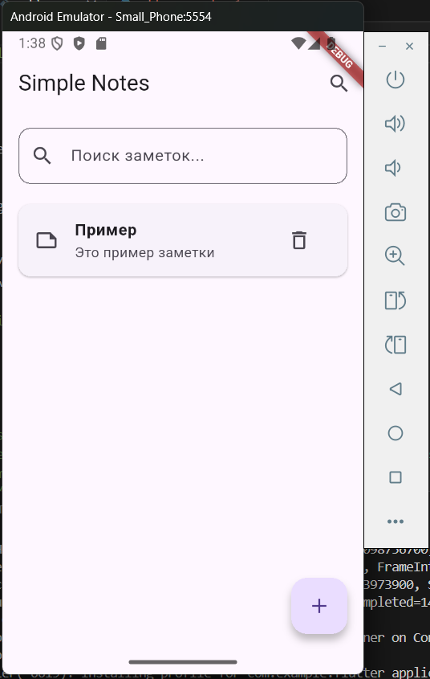

# Практическое занятие №5: Работа со списками и передача данных между модулями

## ЭФБО-09-23 Шарипов Данис

### Цели проекта
- Освоить отображение коллекций данных с использованием ListView.builder
- Изучить базовую навигацию между экранами (Navigator.push / Navigator.pop)
- Научиться передавать данные через конструкторы экранов
- Реализовать функционал добавления, редактирования и удаления элементов списка

---

## Реализованный функционал

### 1. Модель данных
Создан класс `Note` в файле `lib/models/note.dart` для хранения информации о заметках:
- Уникальный идентификатор (id)
- Заголовок (title)
- Текст заметки (body)
- Метод `copyWith()` для удобного обновления объектов
```
class Note {
  final String id;
  String title;
  String body;

  Note({required this.id, required this.title, required this.body});

  Note copyWith({String? title, String? body}) => Note(
        id: id,
        title: title ?? this.title,
        body: body ?? this.body,
      );
}
```
### 2. Главный экран со списком заметок
В `main.dart` реализован экран `NotesPage` с возможностями:
- Отображение списка в виде карточек с закругленными углами
- Удаление заметок через иконку или свайп
- Навигация на экран редактирования по тапу
- Поиск по заголовкам заметок
```dart
body: ListView.builder(
  padding: const EdgeInsets.all(12),
  itemCount: _notes.length,
  itemBuilder: (context, i) {
    final note = _notes[i];
    return Card(
      color: Colors.grey[850],
      shape: RoundedRectangleBorder(
        borderRadius: BorderRadius.circular(16),
      ),
      child: ListTile(
        title: Text(note.title, style: const TextStyle(color: Colors.white)),
        subtitle: Text(note.body, style: const TextStyle(color: Colors.white70)),
        onTap: () => _edit(note),
        trailing: IconButton(
          icon: const Icon(Icons.delete_outline, color: Colors.yellow),
          onPressed: () => _delete(note),
        ),
      ),
    );
  },
),
```
### 3. Экран редактирования и создания заметок
Создан `EditNotePage` (`edit_note_page.dart`) с формой ввода:
- Валидация обязательных полей
- Автогенерация ID для новых заметок
- Обновление существующих через метод `copyWith`
```
void _save() {
  if (!_formKey.currentState!.validate()) return;
  _formKey.currentState!.save();

  final result = (widget.existing == null)
      ? Note(
          id: DateTime.now().millisecondsSinceEpoch.toString(),
          title: _title,
          body: _body,
        )
      : widget.existing!.copyWith(title: _title, body: _body);

  Navigator.pop(context, result);
}
```
### 4. Удаление элементов
Реализовано двумя способами:
- Кнопка удаления в карточке
- Свайп-жест с анимацией
```dart
Dismissible(
  key: ValueKey(note.id),
  direction: DismissDirection.endToStart,
  onDismissed: (_) => _delete(note),
  background: Container(
    color: Colors.red,
    alignment: Alignment.centerRight,
    padding: const EdgeInsets.symmetric(horizontal: 16),
    child: const Icon(Icons.delete, color: Colors.white),
  ),
  child: Card(...),
),
```
### 5. Система поиска
Поиск реализован через `SearchDelegate` с фильтрацией по заголовку:
```
final filtered = _notes
    .where((n) => n.title.toLowerCase().contains(_search.toLowerCase()))
    .toList();
```
---

## Скриншоты приложения




